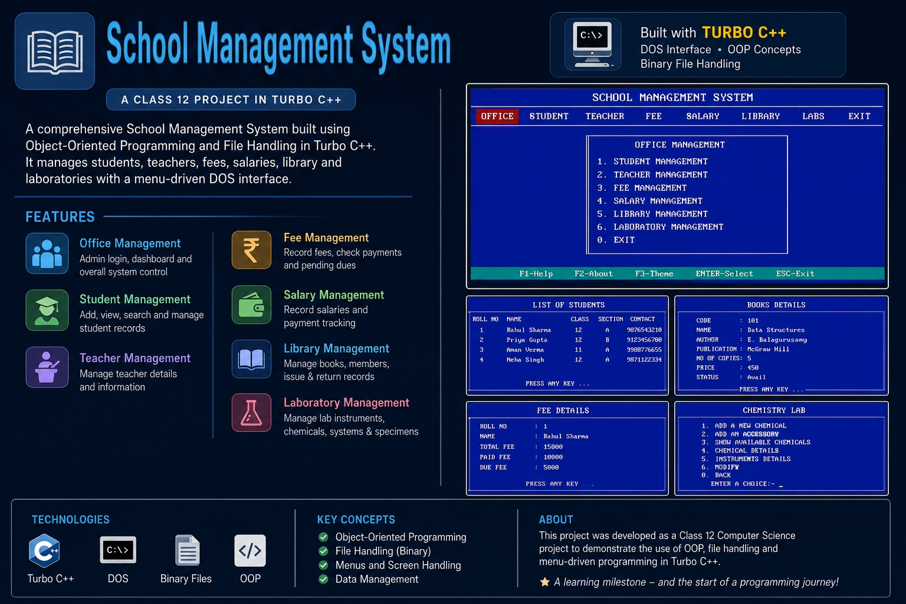
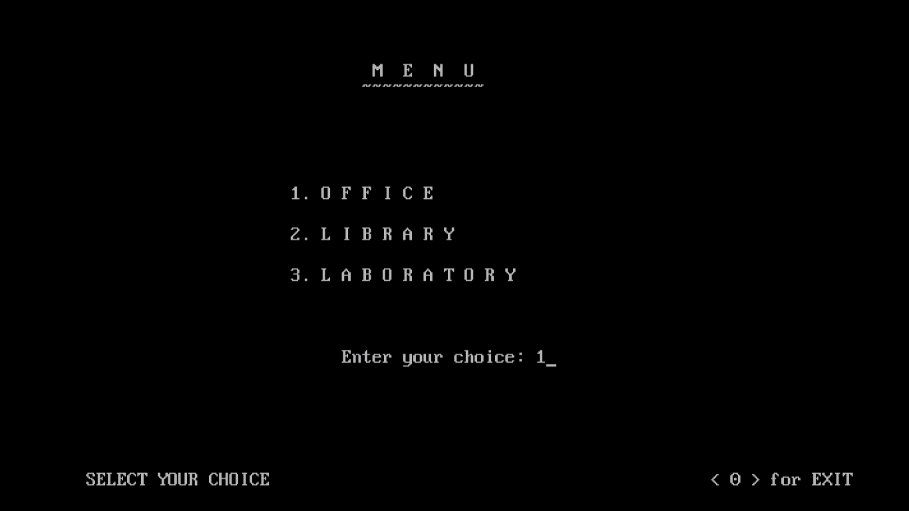
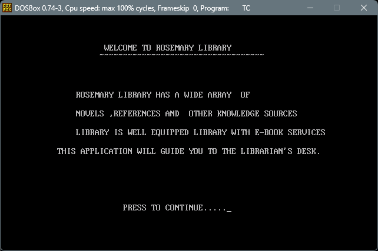

# school-management-system-turbo-cpp
<p align="center">
  
</p>

A School Management System developed in Turbo C++ as my Class 12 Computer Science project.


# School Management System

A School Management System developed using Turbo C++ as my Class 12 Computer Science project.

This project was created to learn and apply Object-Oriented Programming (OOP), file handling, and menu-driven programming. It helps manage different activities in a school, including student records, teacher records, library management, laboratory management, fee management, and salary management.

> **Note:** This project is preserved in its original Turbo C++ implementation as an academic project.

---

## Project Features

### Office Management
- Student record management
- Teacher record management
- Fee management
- Salary management

### Library Management
- Add new books
- View and update book details
- Manage library members
- Issue and return books

### Laboratory Management
- Physics Laboratory
- Chemistry Laboratory
- Computer Laboratory
- Biology Laboratory
- Manage laboratory equipment and materials

---

## Technologies Used

- Turbo C++
- Object-Oriented Programming (OOP)
- Binary File Handling
- DOS Console Interface

---

## Project Structure

```
School-Management-System/
│
├── MAIN.CPP
├── README.md
├── LICENSE
├── screenshots/
└── poster.png
```

---

## How to Run

### Requirements

- Turbo C++ 3.0
- DOSBox (Recommended for modern computers)

### Steps

1. Open the project in Turbo C++.
2. Compile the source file.
3. Run the program.
4. Use the menu to access different modules.

---

## Learning Outcomes

Working on this project helped me understand:

- Object-Oriented Programming
- Classes and Inheritance
- Functions
- File Handling
- Binary File Storage
- Menu-Driven Programming
- Basic Data Management

---

## Screenshots

You can add screenshots of the application inside the `screenshots` folder and display them here.

Example:

```markdown



```

---

## Future Improvements

If I rebuild this project today, I would like to:

- Use modern C++
- Replace binary files with a database
- Build a graphical user interface
- Create a web-based version
- Improve input validation and error handling

---

## About This Repository

This repository contains my original Class 12 Computer Science project. I have kept the code close to its original version to preserve it as part of my learning journey.

Although the project uses Turbo C++, it represents one of my first complete software projects and marks the beginning of my interest in software development.

---

## License

This project is available under the MIT License.
