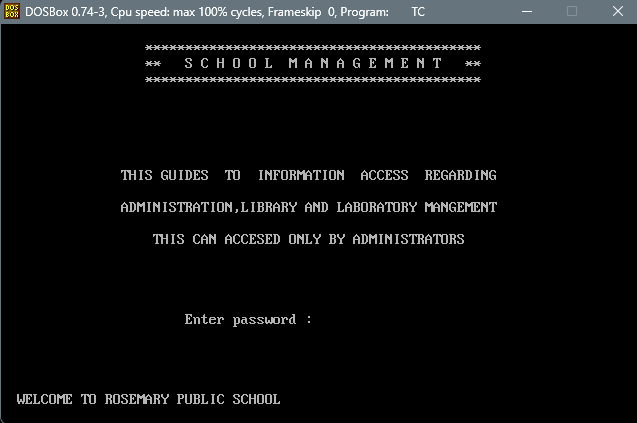
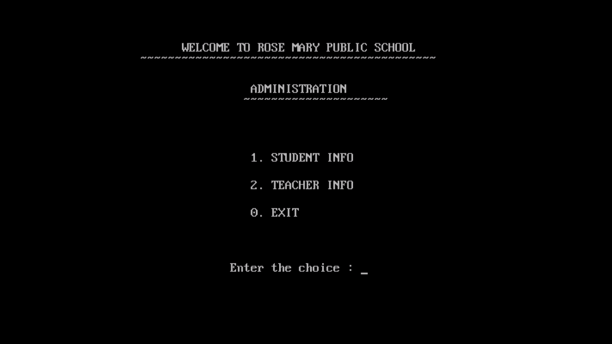
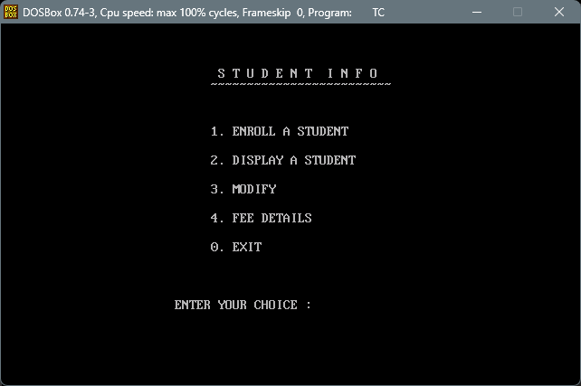
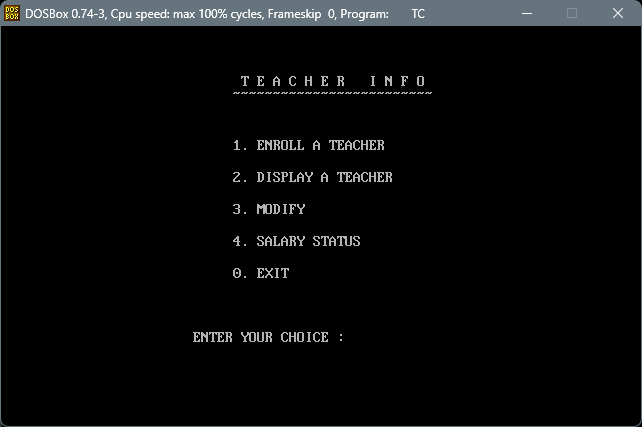
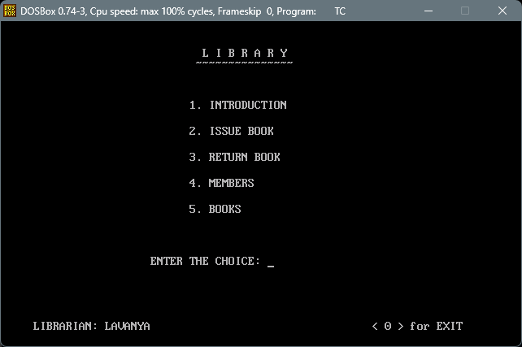
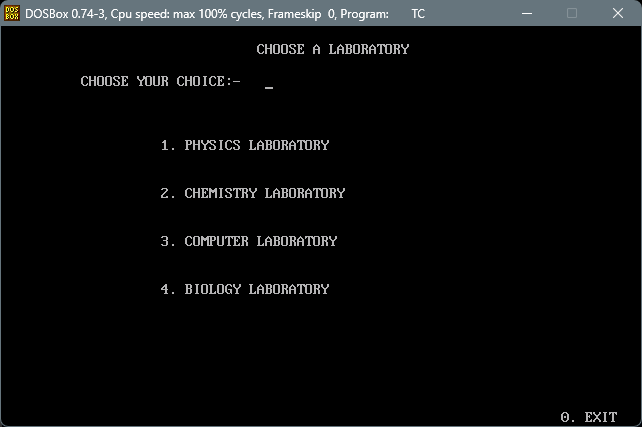

# School Management System


<p align="center">
  
</p>

This project was developed as part of my Class 12 Computer Science curriculum. It demonstrates the use of Object-Oriented Programming (OOP), binary file handling, and menu-driven programming. The system manages student records, teacher records, library operations, laboratory resources, fee management, and salary management.

> **Note:** This project is preserved in its original Turbo C++ implementation as an academic project.

## Project Status

**Status:** Archived Academic Project

This repository preserves the original implementation of my Class 12 Computer Science project and is no longer under active development.

---

## Project Features

### Office Management
- Student record management
- Teacher record management
- Fee management
- Salary management

### Library Management
- Add new books
- View and update book details
- Manage library members
- Issue and return books

### Laboratory Management
- Physics Laboratory
- Chemistry Laboratory
- Computer Laboratory
- Biology Laboratory
- Manage laboratory equipment and materials

---

## Technologies Used

- Turbo C++
- Object-Oriented Programming (OOP)
- Binary File Handling
- DOS Console Interface

---

## Project Structure

```
School-Management-System/
│
├── MAIN.CPP
├── README.md
├── LICENSE
├── screenshots/
└── poster.png
```

---

## How to Run

### Requirements

- Turbo C++ 3.0
- DOSBox (Recommended for modern computers)

### Steps

1. Install Turbo C++ 3.0 or run it through DOSBox.
2. Open `MAIN.CPP`.
3. Compile the project.
4. Run the executable.

---

## Learning Outcomes

Working on this project helped me understand:

- Object-Oriented Programming
- Classes and Inheritance
- Functions
- File Handling
- Binary File Storage
- Menu-Driven Programming
- Basic Data Management

---

## Screenshots

### Login Screen



### Main Menu


### Office Management



### Student Management



### Teacher Management



### Library Management



### Laboratory Management



---

## Future Improvements

If I rebuild this project today, I would like to:

- Use modern C++
- Replace binary files with a database
- Build a graphical user interface
- Create a web-based version
- Improve input validation and error handling

---

## About This Repository

This project was originally developed as my Class 12 Computer Science project and is preserved here in its original form as part of my programming journey.

Although the project uses Turbo C++, it represents one of my first complete software projects and marks the beginning of my interest in software development.

---

## License

This project is available under the MIT License.

---

If you have any suggestions or feedback, feel free to open an issue or submit a pull request.

Thank you for taking the time to explore this project.
